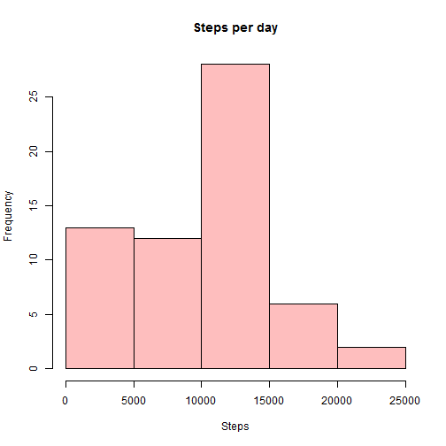
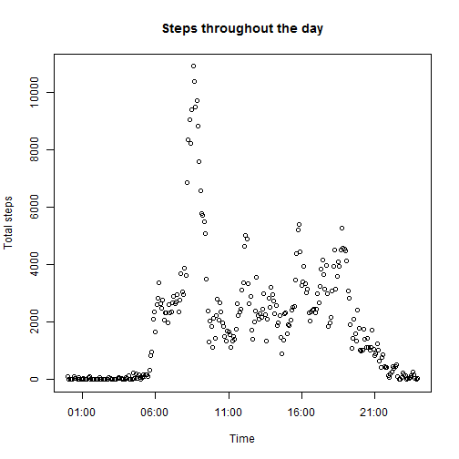
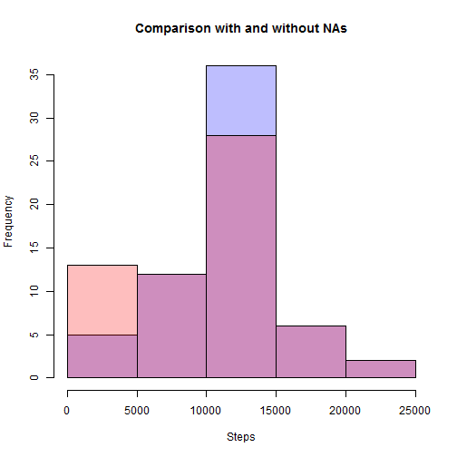
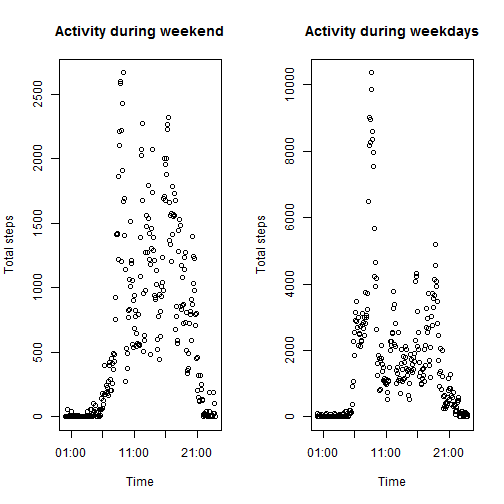

## Loading and preprocessing the data
1. Load the data (i.e. read.csv())
2. Process/transform the data (if necessary) into a format suitable for your analysis

```r
### Loading raw data (already in the repository, compressed)
unzip("activity.zip", overwrite = TRUE)  
act_raw <- read.csv("activity.csv")  
### Converting dates and intervals
act_raw$date <- as.Date(act_raw$date, "%Y-%m-%d")
#act_raw$interval <- as.Date(act_raw$interval, "%HH%MM")
#act_raw$interval <- strptime(str_pad(as.character(act_raw$interval), width=4, side = "left", pad = "0"), "%H%M")
act_raw$interval <- str_pad(as.character(act_raw$interval), width=4, side = "left", pad = "0")
```

## What is mean total number of steps taken per day?
1. Make a histogram of the total number of steps taken each day
2. Calculate and report the mean and median total number of steps taken per day

```r
#act_raw$interval <- as.numeric(act_raw$interval)
act_date <- group_by(act_raw, date)
act_sum <- summarize(act_date, passi=sum(steps, na.rm = TRUE))
h1 <- hist(act_sum$passi, xlab="Steps", main="Steps per day", col=rgb(1,0,0,1/4))
```

 

```r
mean(act_sum$passi)
```

```
## [1] 9354.23
```

```r
median(act_sum$passi)
```

```
## [1] 10395
```
 

## What is the average daily activity pattern?
1. Make a time series plot (i.e. type = "l") of the 5-minute interval (x-axis) and the average number of steps taken, averaged across all days (y-axis)
2. Which 5-minute interval, on average across all the days in the dataset, contains the maximum number of steps?

```r
act_int <- group_by(act_raw, interval)
act_sum <- summarize(act_int, passi=sum(steps, na.rm = TRUE))
# Conversion needed only for plot purposes
act_sum$interval <- strptime(str_pad(as.character(act_sum$interval), width=4, side = "left", pad = "0"), "%H%M")
plot(act_sum, xlab="Time", ylab="Total steps", main="Steps throughout the day")
```

 

```r
#axis.Date(side = 1, act_sum$interval, format = "%H:%M")

max_steps_time <- act_sum$interval[which.max(act_sum$passi)]
format(max_steps_time, "%H:%M")
```

```
## [1] "08:35"
```


## Imputing missing values
Note that there are a number of days/intervals where there are missing values (coded as NA). The presence of missing days may introduce bias into some calculations or summaries of the data.

1. Calculate and report the total number of missing values in the dataset (i.e. the total number of rows with NAs)

2.Devise a strategy for filling in all of the missing values in the dataset. The strategy does not need to be sophisticated. For example, you could use the mean/median for that day, or the mean for that 5-minute interval, etc.

3. Create a new dataset that is equal to the original dataset but with the missing data filled in.

4. Make a histogram of the total number of steps taken each day and Calculate and report the mean and median total number of steps taken per day. Do these values differ from the estimates from the first part of the assignment? What is the impact of imputing missing data on the estimates of the total daily number of steps?


```r
number_of_NA <- sum(is.na(act_raw$steps))
number_of_NA 
```

```
## [1] 2304
```

```r
# Compute the mean of each non-NA time interval to replace the NAs
act_mean <- summarize(act_int, media=mean(steps, na.rm=TRUE))
# Replace the NAs in the raw dataset
# Conversion of time to n 

# act_raw$interval <- as.numeric(act_raw$interval) # Not needed anymore
#act_mean$interval <- as.numeric(strptime(str_pad(as.character(act_mean$interval), width=4, side = "left", pad = "0"), "%H%M"))

# Extract the row with NA steps from the raw data
na_list <- filter(act_raw, is.na(act_raw$steps))

# 1st step
# Merge na_list with act_mean
# Remove all NA column (steps)
na_list <- subset(na_list, select = -c(steps))
# Merge NA row (date and interval) with the replacement values of NAs (identified by interval)
# Of the two subset
azz <- merge(act_mean,na_list, all=TRUE)
azz <- mutate(azz, steps=media)
# 2nd step
# Merge corrected NAs rows with act_raw
azz_final <- merge(azz,act_raw, all=TRUE)
azz_final <- subset(azz_final, select = -c(media) )
act_na_mean <- na.omit(azz_final)

act_na_mean_date <- group_by(act_na_mean, date)
act_sum_na_mean <- summarize(act_na_mean_date, passi=sum(steps, na.rm = TRUE))

h2 <- hist(act_sum_na_mean$passi, xlab="Steps", main="Steps per day", col=rgb(0,0,1,1/4))
```

 

```r
plot( h2, col=rgb(0,0,1,1/4), xlab="Steps", main="Comparison with and without NAs")
plot( h1, col=rgb(1,0,0,1/4), add=T)
```

 

```r
mean(act_sum_na_mean$passi)
```

```
## [1] 10766.19
```

```r
median(act_sum_na_mean$passi)
```

```
## [1] 10766.19
```
## Are there differences in activity patterns between weekdays and weekends?
### The analysis is based on the dataset with estimated NA values


```r
# CHange the language to avoid weekdays in French...
language <- "English" 
Sys.setlocale("LC_TIME", language) 
```

```
## [1] "English_United States.1252"
```

```r
par(mfrow = c(1, 2))

# Create two subset, weekend and weekdays
act_weekend <- act_na_mean_date[weekdays(act_na_mean_date$date) %in% c("Sunday", "Saturday"),]
act_week    <- act_na_mean_date[!(weekdays(act_na_mean_date$date) %in% c("Sunday", "Saturday")),]

act_int_weekend <- group_by(act_weekend, interval)
act_sum_weekend <- summarize(act_int_weekend, passi=sum(steps, na.rm = TRUE))
# Conversion needed only for plot purposes
act_sum_weekend$interval <- strptime(str_pad(as.character(act_sum_weekend$interval), width=4, side = "left", pad = "0"), "%H%M")

plot(act_sum_weekend, xlab="Time", ylab="Total steps", main="Activity during weekend")

act_int_week <- group_by(act_week, interval)
act_sum_week <- summarize(act_int_week, passi=sum(steps, na.rm = TRUE))
# Conversion needed only for plot purposes
act_sum_week$interval <- strptime(str_pad(as.character(act_sum_week$interval), width=4, side = "left", pad = "0"), "%H%M")

plot(act_sum_week, xlab="Time", ylab="Total steps", main="Activity during weekdays")
```

 
